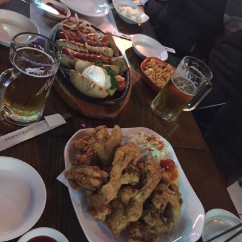

## 구글 앱 엔진 & 구글 컴퓨트 엔진
웹서비스를 만들어도 로컬에서만 실행되면 의미가 없지요.
항상 서비스 하기 위헤 서버가 필요합니다.
cafe24 부터 아마존aws 를 사용 할 수 도 있고,
이번 주제는 PaaS: Platform-as-a-Service 인 구글앱엔진과 가상웹서버인 구글컴퓨트 였습니다.
구글앱엔진은 서버계정일 직접 주지는 않지만 앱엔진 포멧에 맞게 웹서버를 구성하여
구글앱엔진에 올리면 웹서비스 운영이 가능하였습니다.
데이터 모델의 수정이 일부 필요하였고, 실제로 변경되는 코드를
확인하면서 차이점을 설명 들을 수 있었습니다.
이를 보다 쉽게 할 수 있는 장게에 대한 설명도 있었습니다.
내부에 장고와 필요한 라이브러리를 전부 포함하여 패키징하는 앱엔진에 올리는 모양이였습니다.
앱엔진에 아쉬운 점은 있는 그대로의 순수 장고 프로젝트를 그대로 올려서 서비스 하면
개발하는 하는 입장에서 훨씬 좋았을텐데 하는 생각입니다.
아마존aws 같은 구글커뮤트 소개도 있었습니다.
구글커뮤트든 아마존aws든 kt유클라우드든
어떤 것을 쓰던 쓸만한 웹호스팅은 월 5만원 정도의 비용은 드는것 같습니다.
아직은 웹서버를 하나 가지고 있어야 하나 봅니다.
무료로 개바한 장고서비스를 그대로 올려볼 수 있는 서비스가 있었으면 좋을꺼 같습니다.
아직 적당한 서비스가 안보이네요.
구글 앱엔진 & 구글 컴퓨트 소개해주신 정동진님께 감사드립니다.
by 곽두환_141107

## NGS – advanced course(3)
안녕하세요. 지난 NGS 세미나에 참석했던 박성진이라 합니다.
노규형 님이 열심으로 준비해오신 자료와 발표 덕에 참으로 많은 것을 배울 수 있었습니다. 작년도 한창 NGS에 관심이 컸을 때, 여러 leader board가 NGS 시퀀싱 후 함께 나오는 QC (Quality Control) 데이터를 이해하는 것이 매우 중요하다고 언급은 하는데 해당 자료를 찾기 힘들어 무척 애를 먹었죠.(중요한데 안알라쥼...) 초반에 이 부분을 언급해주시니 세미나 4시간 내내 빠져들지 않을 수 없었던 것 같습니다. 세미나 풍경은 아래 김덕근 님이 잘 기록 해주셨기 때문에... 각설하고, 너무 알차고 좋은 자리였고 또한 술자리에서 언급된 논문리딩 소모임도 얼릉 발족되면 좋겠습니다.
"Voi che sapete che cosa é amor : 무엇을 사랑해야 하는지 아는 당신들이여." 라고 어느 노래 가락에서 그러던데 다양한 이유와 동기로 생명정보학에 관심과 애정을 지닌 분들이 모였던 자리였기에 너무나 각별했고 즐거웠습니다.
앞으로 열심으로 함께 하고 싶습니다.
즐거운 한 주 보내세요.
by 박성진_141101

## NGS – advanced course(2)
11/1 일 후기: NGS – advanced course
안녕하세요. 저는 이번에 바이오스핀 모임에 처음 참여한 강양제 입니다. 현재 서울대 식물유전체 연구소에서 포닥으로 근무하고 있고 주 연구 분야는 식량작물 및 산업작물의 표준유전체 작성 및 재분석입니다.
식물분야기 때문에 인간 유전체 분석과는 차이가 있지만 많은 자본이 몰리는 인간 연구는 항상 식물연구의 나아갈 방향을 제시 해줍니다. 이번에 노규형님께서 발표해주신 부분도 현재 인간 유전체 분야에서 핵심적인, 차세대 시퀀서를 이용한 유전형 분석이었습니다. 내용에 대해서는 먼저 후기올려주셔서 정리하지 않겠습니다. (사실 메모를 안하고 들어서 구체적인 기억이 사라졌습니다. 몹쓸 기억력…)
저는 하는 일이 이쪽 분야이지만 애매했던 부분도 많이 알게되어 많은 도움이 되었습니다. 발표 내용이 엄청 방대해서 놀랐습니다. 준비해주신 노규형님의 노고에 감사드립니다. 한번 더 놀란 부분은 정말 여러 분야에서 관심을 가지고 스터디를 하고 있다는 부분이었습니다. 현재 그리고 미래의 학문은 융합없이는 이루어질 수 없습니다. 이날 이전에는 한국은 융합학문이 잘 발전할 토양이 없다고 생각했는데 전혀 아니었습니다. 열정과 의지를 가지고 모인 분들이 저마다의 비전을 가지고 질문을 퍼부으시는데 3시간도 모자란 스터디였습니다. 앞으로 현 스터디에서 저마다의 목적을 발굴하셔서 꼭 좋은 결과 있었으면 좋겠다는 생각을 했고 동시에 바이오스핀 이름으로 좋은 프로젝트가 생길 수 있다면 그것도 즐거울 것 같았습니다.
리눅스, 파이선, 기계학습, 예측 모델, 이미지 분석 등등 그 어느 것 요즘 학문에서 빼 놓을 수 없습니다. 저처럼 생물이 기반인 분도 계시고 컴퓨터가 기반인 분도 계십니다. 서로 다리와 눈이 되어 일한번 내봐요!
by Yang Jae Kang_141101

## NGS – advanced course(1)
바이오스핀의 모험 : NGS advanced course - 1회차 참관후기.
바이오스핀의 모험 첫 번째 시간인데도 정말 많은 분들이 참석하신 것 같습니다. 저도 3시 조금 넘어서 도착했는데 몇자리 않남았었습니다. 정말 열정적으로 공부하시는분들 (취미생활시는분들)과 같은 자리에서 시간을 보냈다는 것에 정말 뿌듯했습니다.^^
NGS advanced corse 첫번째 탐험시간에는 NGS가 무엇인지? NGS를 왜 사용하는지? 어떻게 사용하는지? 이런 전반적인 설명위주로 세세한 설명을 해주셨습니다. 정말 90분이란 시간이 어떻게 지나갔는지 모를 정도로 정말 발표를 잘해주신 것 같습니다. 저는 개인적으로 첫번째 탐험시간 처음부분 PPT인 노규형님의 NGS에 대한 견해와 생물정보학에 대한 생각이 정말 와닿는 부분이었던것 같습니다.
두번째 탐험시간에는 NGS장비에서 데이터가 어떻게 만들어지고 만들어지는 데이터의 정보를 어떻게 해석하는지에 대한 설명. 그리고 이렇게 만들어진 데이터들을 어떻게 활용해서 variant들이 나오는지에 대한 간단한 알고리즘 설명으로 생물정보학을 전공안했어도 어느정도 이해할수있는 정도의 설명이었습니다. 그리고 reference squence에 대한 설명을 할때는 유전학의 유래에 대한 설명들이 주위에서 부연설명을 덧붙여 주시면서 정말 흥미진진한 시간이 되었던 것 같습니다. 제가 미쳐알지 못한부분들을 많이 알게 해주셔서 정말 감사했습니다~~~^^
세번째 탐험시간에는 NGS장비에서 나오는 데이터를 이용하는 분석도구들소개와 어떠한 알고리즘을 통해서 어떻게 분석이 이루어지는지에 대한 설명들이 이루어졌던 것 같습니다. 노규형님의 경험담을 통한 장단점을 설명해주셔서 더욱 쉽게 이해할수있었던 것 같습니다.
정해진 시간으로 인해서 특강을 아쉬운 마음으로 마치고 늘 뒷풀이하는 곳에서 자기소개를 세번째로하고 배고픈 배를 채우면 즐거운 담소로 마무리 한 것 같습니다.
정말 많이 준비해주셨는데 정해진 시간내에 해주시느라 정말 고생많이 하셨습니다. 앞으로 바이오스핀의 모험 시간이 더욱 기대됩니다. 다음에는 IT일을 하시는 분들도 많이 계시니까. NGS 분석 Tool들에 대한 분석을 알고리즘적으로 접근하는 시간을 갖어도 정말 재밌는 시간이 될 것 같습니다.
정말 재미있는 아이디어들이 쏟아져 나올수있을 것 같습니다.
마지막으로 특강해주신 노규형님께 다시 한번 감사드리고 허접한 글재주로 쓴 후기 읽어주셔서 감사합니다.
by 김덕근_141101

## ‎아두베리스핀‬ 미니실습 -‪아두이노
아두이노 후기입니다.
질좋은 소고기는 따로 양념장도 없이 살짝 구어서 소금만 찍어 먹는데
강의자님 덕분에 미사여구 없이도 아두이노 매력을 있는 그래도 잘 느낄 수 있었습니다.
원체 하드웨어 기반 지식이 풍부한 강의자님 덕분에 강의 내내 아두이노 이외에도
하드웨어 기반에 이야기들이 종횡으로 영역 구분없이 넘나들어서 좋았습니다.
보는 시야가 넓어서 역시 실무하시분들에 강의는 남다른듯 합니다.
질문이 많이 나올 수록 좋은 강의인데 강의중에도 물어 보고 싶은게 많아져서 질문이 많았습니다.
중학교때 배웠다던 V=IR부터 클럭, 인터럽트, 타임테이블, emf 등에 용어가 범람했고,
처음 바이오파이썬 스터디 모임때랑 비슷한 기분이였습니다. ngs, 마이크로rna ,rna시퀀싱...
실습은 꼬마 전구에 불켜기와 비슷한 난이도에 전자기 필드 저항(emf) 측정 실습이였습니다.
실습내용은 전자기장내 변하는 저항을 값을 읽어서 출력하는 쉬운 실습이였습니다.
os를 가지고 있는 라즈베리파이는 직접 라즈베리파이에 접속하여 수행하는것과 달리
아두이노는 프로그램을 usb 포트로 업로드하고 수행하는 방식이였습니다.
아두이노로 변화하는 저항 값을 받고 노트북과 아두이노 사이에 시리얼포트로
파이썬이 serial 데이터를 받아서 파이썬 내에서 값을 출력해주었습니다.
작지만 의미 있는 실습이였습니다.
장님이 눈뜻듯 다양한 가능성이 눈에 보이는 듯 하였습니다.
저에는 멀게 느껴졌던 것들이 손에 잡힐듯이 보여서 해보고 싶은게 많아졌네요
1회 단발 미니 실습으로 자칫 수박 겉핥기 식이 될 수 있었는데
수박 제일 한 가운데 부문만 퍼먹은 느낌입니다.
강의해주신 심상진님께 다시 한번 감사 드립니다.
by 곽두환_141030

## ‎아두베리스핀‬ 미니실습 - ‪‎라즈베리파이‬(2)
조촐하지만 알찼던 스터디! 스터디 내내 흘러나오는 라즈베리파이로 만든 '방금 그 라디오'와 라이브 코딩으로 선보였던 꼬마 전구에 불 키기가 압권!^^
백문이 불여일견이라고 라즈베리파이에 대해 감 잡을 수 있었던 시간이었습니다~발표해 주신 곽두환 님, 기획하신 MooSung Kim 님에게 감사를!^^
첫 참석해주신 KwangChun Lee 님의 식견에도 많은 도움을 받았습니다~무려 라즈베리파이 책까지 들고 오신 박정은 님..저만 아무 생각 없이 참여했던건가요~^^
다행히 진짜 정통 심리학도인 Do Kang Hyuk 군이 있어서 위안을 삼을 수 있었습니다.
무성님의 직장 동료분도 반가웠어요~^^댓글이 후기가 되어버리나요..이만 줄입니다!^^
by Ka-Kyung Kim_141029

## ‎아두베리스핀‬ 미니실습 - ‪‎라즈베리파이‬(1)
스터디룸 문을 열고 들어가니, 음악이 흐르고 있었습니다. 앵그리버드 모양의 스피커에서 말이죠. 그리고 사람들이 오손도손 앉아서 스터디 시작을 기다리고 있었죠. 발표를 맡은 곽두환님이 말했습니다. '이제 시작할까요?'
만두와 김밥이 공수되고, 꼬마전구를 켜기 위한 두환님의 라이브코딩이 펼쳐지고. 익숙한 파이썬 언어가 화면에서 보였으며, 익숙하지 않은 라즈베리파이에 연결된 꼬마전구가 푸른 빛을 깜빡거리며 내기 시작했죠. 저는 '해커스'라는 책의 한 장면이 떠올랐습니다. 컴퓨터산업 초창기에 사람들이 모여서 보드를 제어하고 키보드를 붙이고 화면을 '해킹'하던 그 장면이요.
아두베리스핀은 라즈베리파이와 아두이노에 대해 알아보고 작은 실습을 해보는 이벤트로 기획되었습니다. 바이오스핀의 곽두환님과 Sangjin Sim님이 해당 기기들에 대한 경험이 있다고 해서 마련된 특강이죠. 아직 장기간 스터디로 갈지는 미지수지만, 키보드의 타이핑의 결과가 실제 '사물'을 움직이는 것을 보는 것은 여러가지 영감을 주더군요.
요약하면, 김밥과 만두 먹고(Ka-Kyung Kim님과 도강혁에게 감사를) 자기소개를 각자 한뒤에, 곽두환님이 라즈베리파이 소개하고 꼬마전구 불 켜고 끄는거 시연 보여주고, 곽두환님이 예전에 만든 '방금 그 라디오(현재 라디오방송에서 음악만 추출해서 들려줌)'에 대한 얘기를 듣고, 몇명은 남아서 맥주를 마셨습니다.
재미난 시간이었습니다.
by 김무성_141029

## PART II - 쉬어가기 장고3회 , agngularJS
바이오파이썬 쉬어가기 : django - 3회차 + AngularJS
오늘 바이오파이썬 쉬어가기 3번째 스터디가 있었습니다.
첫번째 세션에서 김무성님의 파이썬 장고 3차 강의가 있었으며, 이전 1,2차에 걸친 REST 환경을 더욱더 완성도 높이는 시간이었습니다. Django REST framework (http://www.django-rest-framework.org/) 을
사용하여 이전의 raw coding 을 더욱 깔끔하게 만들고, Token authentication 까지 구현하는 것을 소개해 주었습니다.
또한 Requests (http://docs.python-requests.org/en/latest/) 모듈까지 소개하면서 REST api 접근법까지 일관성있는 설명을 해주었습니다. 무성님 특유의 핵심정리 설명으로 장고 REST 시스템을 잘 보여주었습니다.
사실 post, get, put, delete 4가지 모두를 raw coding으로 django REST 구현한 것은 웹상이나 책에서 보기 어려운 것이었는데...
지난 3차간의 장고 스터디는 무성님 본인의 노하우를 아낌없이 나누어 주는 장고 스터디 시간 이었던듯..
제 개인적으로는 framework 설명보다는 이런 raw coding 이 훨씬 배우는게 많은듯..
다시한번 감사.. 무성님 !!!!
두번째 세션에서는 김현동님의 화련한 라이브코딩 강좌가 있었습니다.
구글이 지원하는 말로만 듣던 AngularJS (https://www.angularjs.org/) 를 단순한 문법 설명만 하는게 아니라, 왜 본인이 AngularJS 를 사용해야 했나 하는 필요성에 대한 지나간 과정을 보여주고,
live coding 으로 직접 보통의 javascript 로 짠 코드와 비교 설명해 주어서 느낌 팍 받은 시간이었습니다. 그리고 Firebase (https://www.firebase.com/) 와 Parse (https://www.parse.com/) 를 이용하여 어떻게 편리하고 생산성있게 웹개발 할 수있는지를 보여주는 live AngularJS coding 은 정말 돈내고 등록하여 듣는 그 어떠한 IT conference 보다 훌륭한 시간이었습니다.
아마도 당분간 AngularJS, Firebase, Parse 의 매력에 푹 빠질듯 합니다.
정말 고마운 시간이었습니다. 김현동님 .. 감사!!!
오늘 배운 것들은 웹의 백엔드와 프론트엔드의 핫이슈를 보여주었으며, 개인 프로젝트에 엄청난 도움이 될듯...
혼자서 공부했으면 몇달을 가지고도 부족했을 시간을 정말 몇시간만에 이룬듯.. 뿌듯합니다...
다음주에 있을 google app engine 강좌를 기대하며.... 이상 후기를 마침니다.
by 박홍훈_141028

## PART II - 쉬어가기 장고2회
비가 촉촉히 내리는 화요일 저녁시간.
[쉬어가기 장고-1회차]에 참석 못한 아쉬움에 조금이라도 늦지 않으려했지만,
언제나 그렇듯 회사일은 예측불가- 30분이 조금 지나서 토즈에 도착했습니다.
역시나
무성님의 쩌렁쩌렁한 목소리가 복도까지 퍼지고 있었고,
조심스레 강의실로 들어가니 강의실은 이미 실습 열기가 후끈.
슬라이드에는 터미널에 알 수 없는 용어들이 난무했고,,,
2시간을 어떻게 보낼지 살짝 걱정되더라구요. (이래서 지각하면 안됨)
수업은
로컬에서 작업한 내용을 git에 올리고 cloud에서 git 내용을 받아서 web server를 실행시키는 방식으로 실습이 진행됐습니다ᆞ
그 후에
GET, POST, PUT, DELETE 방식으로 server 에 request 를 보내고 crome브라우저에서 response를 확인하는 강의와 실습이 진행됐습니다.
좋은 아이템으로 web service를 해보고 싶은 로망이 있었던 저에겐
cloud환경에서 django를 활용한 RESTful 서비스는 정말 유익한 강의였습니다.
차주에 있을 강의도 살짝 기대해봅니다.^^
강의해주신 무성님 감사 ᆞ강의 지원해주신 분들도 모두 감사합니다.
토즈1층에 있는 문구가 신기해서 한컷 찍었습니다. 선데이 토즈처럼 토즈에서 원하는 것들을 모두 얻어가셨으면 좋겠다는 생각과 함께~ 2회차 후기를 마칩니다.
(토즈 직원 아님 ㅋ)
담주에뵈요~~~
by 이광수_141022

## PART II - 쉬어가기 장고1회
김무성님의 쉬어가기 장고 - 1회차 후기
전에 django를 혼자해보려다가 이해는 못하고
예제만 따라하다가 책을 덮었었어요 ㅜㅜ
그래서 더 기다리고 있었던 session이었습니다 !
IT 쪽을 잘 알지못하는 사람들을 위해서
기본 개념(MVC + REST API --> django)부터
여느 스타강사처럼
보드를 사용하시면서 최대한 쉽게 설명해주셨고
중간중간 IT느님들을 위해
암호로된
단어들('*** 쓰세요?' / '요즘엔 ** 많이 쓰더라' / '**에서는 **이 불편하다' / '쉽죠?')을
던지시면서 모두 집중할 수 있게 해주셨습니다.
django 설치는 간단하게 넘어가고
project 하나에 app하나를 만들어서
REST API를 구현해보는 것을 먼저 보여주셨어요.
그리고 바로 실습을 하였습니다.
개인적로 실습하는 시간이 도움이 많이 되었고
간단한 개인앱을 비슷하게 만들어 보면서
모르는 것 또는 에러를 무성님에게 여쭈어볼 수 있었습니다.
마지막에
admin page를 보여주며 모두의 환심을 산 뒤에
database와의 연동에 대한
암호들을 한번더 외우시며
마무리 해주셨습니다.
1차의 속도라면 3차에서는
정말로 멋진걸 할 수 있을 것 같아요 !
복습해가야겠네요.
무성님 좋은강의 감사합니다ㅋㅋ
by Kang-ik Kevin Cho_141015

## PART II - 9회차
가경님 20분 한다던 강의도 1시간을 넘어가고 원래 하려던거보다 항상 더 많이하는 스터디.
바이오스핀 스터디 후기입니다.
늘 좋은 사진 찍어주시는 가경님 강의였습니다. 감사의 의미로 희귀본인 가경님 강의샷을
이번주 대문사진으로 올려 두었습니다. 역시 바이오쪽은 쉽게 이해하기 어렵네요.
그래도 계속 듣다보면 귀가 트일날이 올거라 믿습니다. 세진님이 추천해준 "내 생명의 설계도"를 읽고 있는데
쭈욱 들어 두었던 바이오 스터디 내용이 책읽은데 도움이 되네요. 파편화 되어 있었던 바이오 지식도 쓸모가 있습니다.
세진님의 열혈 R강의. R세계에 푸욱 빠져있다가 나왔네요
몰입도 있는 강의로 왠지 R을 잘 할 수 있을꺼 같습니다.
알맹이만 쏙 가져가는 기분입니다.
듣고 나면 뭔가 해보고 싶은게 많아 지는게 스터디의 장점이 아닐까 싶습니다.
한동안 바이오 데이터 분석 강의 듣다보니 진로를 이쪽으로 잡아 볼까 데이터 분석을 해볼까 하다가
오늘 R을 듣고 난 후에는 예전에 했던 apm 에 적용해 보고픈 생각이 막 듭니다.
모니터링 데이터를 차트, 표로 시각해 했어햐 하는데 예전에는 js 기반에 차트 사용했는데.
웹 기반으로 R 사용하여 시각화 하면 좋을꺼 같다는 생각이 마구 드네요.
오늘은 다시 apm 해보고 싶은 생각이 막 듭니다. 전보다 쉽고 멋있게 만들 수 있을꺼 같네요.
듣고 나면 새로운 인사이트를 얻어가는데 스터디의 장점인것 같습니다.
배워서 남주자를 실천해주신 강사분들께 다시 한 번 감사드립니다.
by 곽두환_141007

## PART II - 8회차
‪#‎바이오스핀‬ ‪#‎바이오파이썬‬ 이 스터디의 핵심 뒷풀이 중입니다~
바이오파이썬 파트2 - 8회차 스터디 후기입니다.
후기에서 알리려던 것 보다 빠르게 결과물이 나와서 약간 뒷북이 되었습니다만,
요번 회차에선 몇가지 신기한 것들을 했습니다.
1. 빅데이터 특강
이번에는 보강, 아니 특강 시간이었습니다. 원래 교재가 좀 심심해서 보충을 할겸 보강 체제가 들어갔는데 점점, 특강 퀄리티로 올라가고 있습니다. 이번에는 김민경 님이 빅데이터 시스템을 구축하기 위한 오픈소스들을 소개해주셨습니다. 하둡과 스파크로 홍보를 했는데, 그 외에 다른 서트파티들, 그리고 바이오인포매틱스에서 유용하게 쓸만한 빅데이터 관련 서드파티들. 에 대해서 소개를 들었습니다. 그리고 직접 만들고 계신 빅데이터 솔루션 데모도 보고, Q&A 시간을 가졌습니다.
2. 길고 긴 자기소개
이번에 특강을 들으러 오신 분이 많아서(성공!) 자기소개 시간도 매우~ 길어졌습니다. 늘 얘기하다시피 바이오스핀의 스터디는 늘 열려있고 새로운 분들의 참여를 환영합니다. 그리고 자기소개를 매우 중요시 합니다. 그래서 각자 자기소개를 하는데 정말 여러 분과에서 오셨어요. 전공모임이라기보다는 관심자 모임이라서, 더 다양한 분들이 참여가능하신 것 같습니다. 그리고 그걸 원하구요. 그리고 이 다양한 배경에 맞춰서, QnA 시간에 여러 관점의 질문과 이야기들이 오갔습니다.
3. 뒷풀이
뒷풀이는 10명만딱. 그래도 원래 스터디원들 반, 새로오신 분들 반이니. 특강의 취지에 매우 부합했다고 생각합니다. 그렇습니다. 바이오스핀의 스터디는 사교가 궁극목표입니다.
4. 바이오스핀튜브
이미 공지가 나갔지만, 최초로 발표를 동영상 촬영해서, 공유하였습니다. 동영상 만들자. 라는 의견이 잠깐 나왔지만 아무래도 거부감도 있고, 발표하시는 분들도 많이 부담느끼시고 하겠죠. 그래서 한번 하나 정도만 만들어보자. 그리고 선택적으로 자원받아서 만들고 공유하자. 라고 시도해봤습니다. 반장난삼아 '바이오스핀튜브'라고 비밀프로젝트처럼 시작했는데. 정말 그것이 이루어졌습니다. 많은 분들이 의견주시고, 고생하셨지만 가장 고생을 많이 한 Ka-Kyung Kim님과 이성호님, 그리고 첫 발표를 맡아주신 김민경님께 가장 감사를 드립니다. 저희가 비영리, 취미, 사교 스터디 그룹이라 프로페셔널하게 자료들이 제작되거나 배포되진 못하겠지만. 그래도 가능한한 많은 분들과 나누도록 해보겠습니다.
이상으로 후기를 마칩니다.
(아, 다음주가 파트2 공식일정 마지막 입니다. 보강으로 R에 대해서 Sejin Park님이 발표하실거에요. 많이들 놀러오세요~)
by 김무성_140930

## PART II - 7회차(2)
파이썬을 이용한 바이오인포매틱스 기초 : PART II - 7회차 스터디 후기
이미 김무성님께서 정리를 잘 해주셔서 간단히 덧붙여 보겠습니다ㅋ
(어제 스터디가 끝나자 마자 야근하러 가시던데.. 언제 또 이렇게 후기를 작성해 주셨는지ㅋㅋ 대단하십니다!)
첫 발표는 조강익님께서 PDB 파일을 parsing하는 법을 보여 주셨습니다. 단백질 구조를 전공한 사람이 없어 결과 해석에 어려움이 있었지만ㅜㅜ residue가 무엇이냐는 질문에 생물학 전공자인 저희들도 크게 고심을 안해본터라 당황을 했었는데요..ㅋ 결국엔 김용남님 말씀처럼 별로 중요하지 않으니 패스하는 걸로ㅋㅋ
pymol을 이용해 단백질 구조를 visualization 하는 것은 꽤 유용해 보였습니다. 프로젝터의 해상도가 떨어져서 인지 실시간으로 구현하는 걸 못봐서 아쉬웠지만 명령어 몇줄이면 쉽게 접근할 수 있을 것 같아 여러모로 응용이 가능할 것 같습니다. 한가지 예를 들어보자면 Exome-seq으로 찾은 DNA의 돌연변이로 인해 단백질의 어떤 residue가 어떻게 바뀔지 예측해 볼 수 있는데요 (ex. Lys -> Ala) 이 때 달라진 residue가 단백질 구조 상에서 어디에 위치하는지 (활성을 가지는 중요한 site이면 논문의 impact factor가 쑥쑥 올라갑니다^^) 그 변이로 인해 구조가 어떻게 바뀌는지 등을 알아볼 수 있겠네요.
두번째 발표는 조정희님께서 web에서 data를 불러와 parsing하는 법을 보여주셨습니다. 고전적인 방법으로 urllib module을 쓰는 법도 있었으나 mechanics나 beutifulsoup을 사용하면 훨씬 쉬어 보이더라구요. 조정희님께선 생물학 전공으로 알고 있는데 구글 서치해가며 새로운 module을 사용하시는 모습이 인상깊었습니다^^ 하루 이틀만에 할 수 있는 것들은 아니니까요ㅋ biopython 패키지 중, entrez database를 이용하는 법도 배웠는데요 ncbi는 생물학자라면 거의 매일 들락날락 하다시피 하는 굉장히 중요한 사이트입니다. 이것을 웹브라우저가 아닌 python에서 접근할 수 있어 자동화나 parsing 등이 굉장히 편해 보였는데요. 어떻게 활용하느냐에 따라 일주일을 꼬박 걸릴 일들도 단 몇분만에 완성시킬 수 있을 것 같습니다. pubmed에서 논문 abstract들을 긁어 오는 것도 유용할테고, gene들의 nucleotide sequence를 검색해서 저장하는 데도 응용할 수 있겠네요.
바이오 스핀 스터디를 통해 항상 좋은 정보 얻어가고 있습니다. 어느덧 part II도 중반을 넘어서고 있는데요. 앞으로 더 활기찬 교류의 장이 되었으면 좋겠습니다. 감사합니다^^
by 김다찬_140924

## PART II - 7회차(1)
긴 후기는 다른 분이 써주실 테니, 짧게 요약해보겠습니다.
이번 발표자분들은 다 바이오인포쪽도 아니고 IT쪽도 아닌 분야의 분들이었습니다. 첫번째 발표를 맡은 Kang-ik Kevin Cho씨는 뉴로사이언스 연구자였습니다. 그래서 발표 중간중간 뇌영상 분야의 예제와 비교해보며 진행되었습니다. 내용은 PDB라는 단백질의 3차원 구조를 담고 있는 파일을 어떻게 처리하고 시각화 하는지에 대한 것이었습니다. 슬라이드 중간중간 삽입된 아기자기한 그림들이 인상적이었고, 차분한 설명이 귀에 쏙쏙 들어오더군요.
그리고 두번째 발표자는 기상데이터와 식물연구를 연결해서 하고 있는 조정희씨였습니다. 주제는 웹에서 데이터 가져와 연구하기였는데, 처음엔 생물정보쪽에 많이 쓰이는 주요 연구 사이트와 DB에 접근해서 정보를 가져오는 것이었고, 후반부는 Beautiful Soup를 활용해서 웹페이지를 크롤링하고 파싱하는 예제였습니다. 그런데 이 예제를 , 원래 책의 내용에 더해서, 기상데이터 도메인으로 바꾸고, 좀 더 실용적인 라이브러리(판다스 같은)들을 써서 발표를 했습니다. 아, 이럴수가.
역시, 중간중간 질문과 대답이 폭발하는 시간이 있었는데요. 단백질에 대해서 바이오쪽에서, 프로그래밍에 대해서 IT쪽에서, 서로 모르는 점을 알려줬습니다. 특히 보안전문가답게, 조근영씨가 웹크롤링에 대해 이런저런 설명을 해주는 모습이 참 인상깊었습니다. 멋있어요~
오늘은 다들 바빠서 뒷풀이를 하지 않았습니다. 다음 주에 꼭 합니다. 특히 다음주 보강은 '바이오빅데이터'라는 주제로, 김민경님이 하둡과 스파크에 대해서 소개해주실거에요. 많이들 들으러 오세요~
이상으로 후기를 마칩니다.
by 김무성_140923

## PART II - 6회차
안녕하세요,
바이오파이썬 PART2-6 후기작성을 할.당.받은 배준석입니다.
여기서도 왠지 자기소개를 해야할 것 같군요..
어제 스터디는 총 3분이 발표를 해주셨는데요,
첫째로, 이우제님께서 NGS와 epigenetics의 개념과 실험기법에 대해서 설명해주셨습니다. NGS실험을 직접 수행하는 제 입장에서 들어도, 매우 핵심적인 내용만 설명해주셔서 좋은수업을 들은듯한 느낌을 받았고, 특히 epigenetics 부분에서 질문할 것이 많았었는데 (저는 genomics와 transcriptomics를 공부하는 사람이라서), 다른분들의 질문들이 좀 더 새로운 시각이신것 같아서, 경청하는 자세를 계속 유지했습니다. 특히, 생명현상의 원리를 물으시던 물리학과 분이 인상깊으셨습니다.
둘째로, 김다찬님께서 NGS로 RNA-seq을 어떻게 분석하는지, 그 pipe line을 설명해주셨습니다. 저희 실험실에서도 RNA-seq의 pipe-line개발이 항상 hot issue인데요, 여러가지 tool들을 비교해서 돌려보며, 암 종별로 가장 효율적인 pipe-line을 개발하고 있습니다. 시간과 비용이 꽤 오래걸리는 작업이거든요..특히, 다찬님께서 각각 step에서의 산출되는 output의 내용들을 하나하나 설명해주시는 것이 인상깊었는데요, 그 설명을 들으며, 혹시 생물학을 하시던 분이가? 라고 생각했었는데(제 경험상 생물학 하시던 분들이 그런것 하나하나 궁금해하며 집착하거든요), 역시나, 다찬씨도 생물학을 전공하셨더라구요.. 다방면에서 열정을 가지고 공부하시는 모습을 보고 대단한 사람이구나 생각했습니다.
셋째로, 연세대학교 천재학부생님께서 snakeman에 대해서 발표를 해주셨습니다. (연대천재학부생의 이미지가 강해서 이름이 잘 생각나지 않아요.ㅠ)
이 session은 computer science의 색이 짙은 부분인것 같아서, 제가 완벽하게 이해를 하지 못하긴 했는데,익혀 두면 pipeline 작업시 유용할 것 같다라는 생각을 했습니다. 전 사실, 내용보다도 천재학부생님의 연구에 대한 자세와 자신감이 매우 인상깊었습니다. 연구에 나이가 중요하지는 않지만, 저보다도 10살이나 어린나이지만 연구내용 뿐만아니라 여러가지로 배울 것이 많다고 생각했습니다. 앞으로 스터디에서 지속적으로 참여해서, 자신의 재능을 많은 분들께 보여주셨으면 좋겠습니다.
뒷풀이는,
제가 약 3개월 동안 스터디에 참여하면서 처음 가봤는데요(죄송합니다.ㅠ)
각자의 분야가 전혀다른 분들이 모이다보니, 이야기가 계속 나오는..
매우 희한한 매력을 가지는 술자리 였습니다. 약 1시간가량 술자리가 지속되어도 이야기가 마르지 않는 오아시스와 같다고 할까...
교실에서 선생님들과 술마시는 느낌이었습니다. ㅎㅎㅎ 감사드립니다.
특히, 술값을 계산해주신 박홍훈님께 머리숙여 진심으로 감사드립니다.
이상으로, 후기 마치겠습니다.
모두 안녕히 주무시고, 혹은 좋은 아침 되세요
by 배준석_140918

## PART II - 5회차
김무성씨가 오늘 사진은 이미 올렸고 저는 출석체크 겸해서 후기 남깁니다. 1부 발표자 Geun Yeong Jo씨는 IPYTHON notebook을 이용해서 파이썬의 각종 error와 exception을 처리하는 방법과 초심자가 겪을 수 있는 함정 등을 알기 쉽게 설명해 주셨고 "파이썬과 마인드맵 그리는 것은 그리 다르지 않다"는 말로 깔끔한 마무리까지 해 주시는 내공을 보여주셨고요. 두 번째 발표자 Chang Soon Choi 씨는 파이썬을 이용해 각종 그래프와 차트를 그리는 방법과 함께 2D RNA를 보여 주셨고 RNAstructure Software package데 대한 팁까지 준비하시는 센스를 보여 주셨습니다. 배워서 남 주려는 분들만 모이셨는지 dna origami 라는 신기방기한 그림까지 찾아서 알려주시는 분도 계셨는데요. 열기와 훈훈함이 비가 오는 강남을 사람이 있어 아름다운 공간으로 느끼게 해주었습니다. 2부 중간에 우리 몸이 질병에 대응하는 기제가 잘 되어 있는데 그 역치를 넘으면 병에 걸린다는 말도 기억에 남는데요. 제가 열심히 돌보지 않아도 알아서 잘 살아보려는 제 몸에게도 오늘 감사한 마음이 생겼습니다. 자연의 질서 앞에서 저희는 아직도 자그마한 존재더군요. ^^ 그럼 다음 주에 건강한 모습과 경계를 넘나드는 열림 마음으로 다시 뵈어요. 혹시 안 보이면 저 역시 인간에 대한 호기심으로 어디에선가 열심히 일하고 있을 것이라고 믿어 주시면 좋겠습니다. 긴 글 끝까지 읽어 주셔서 감사합니다.
by Young Sook Song_140903

## PART II - 4회차
'디버깅은 이렇게!'
이번에는 뒷풀이가 없었습니다. 아쉬워하는 분들 많았어요. 그래서 앞으론 뒷풀이가 있을지 미리 예고하겠습니다. ㅎㅎㅎ
이번 회차에서의 스터디 내용과 분위기는 박홍훈님이 후기에서 잘 정리해주셨습니다. 기본적으로 IT적인 쪽으로는, 파이썬으로 어떻게 좀 코드 잘 정리하고 재사용성을 높여 프로그래밍할까에 대한 것이었습니다. 함수를 만들거나, 좀 더 나가면 클래스로 만드는거죠. 그리고 디버깅 방법도 소개. 조근영씨가 디버깅하기, 함수만들기를. 정우성씨가 클래스 만들기를 맡으셨습니다. 그리고 조근영씨의 발표 예제는 대부분 단백질 정보를 담고 있는 PDB 파일을 다루는 것이었습니다. 다른 시간에 PDB에 담긴 단백질 3차원 정보를 본격적으로 다루는 예제가 등장합니다. 이번에는 부분부분별로만. 그리고 정우성씨의 클래스 파트는 유전학 관련한 예제였습니다. 클래스로 멘델 완두콩 시뮬레이션 하는 거였는데. 재밌었어요. 그래서 정우성씨가 유전학 관련한 바이오 미니토크를 준비해주셨습니다.
역시, 조근영씨의 말이 제일 기억에 남습니다.
"운전은 할 줄 안다. 차는 모른다"
이번 스터디때도 역시 서로의 분야에 대한 질문과 설명이 많이 오갔던 수다스러운 시간이었습니다. 그럼 다음 시간에도 재밌게 공부해봅시다~
by 김무성_140826

## PART II - 3회차(2)
안녕하세요, 뒤풀이 담당 김무성입니다. 후기가 늦었습니다.
뒷풀이에 꽤 많은 분들이 참여하셨습니다. 강남토즈타워점으로 옮기면서, 근처의 큰 맥주집을 발견했습니다. 저번 뒷풀이 장소는 10명이 거의 한계였는데, 여기선 30명도 가능할듯 합니다. 하지만 아직은 15~6명 정도의 사람이 참여했습니다. "저 집에서 허락받았어요. 오늘은'이라고 해맑게 웃던 이성호씨의 얼굴이 가장 인상에 남더군요. 여러 배경의 사람들이 북적북적 자기 얘기와 분야 소개를 하면서 재밌게 먹고 마셨습니다. 뒷풀이가 자주하긴 점점 어렵지만 적어도 한달에 한번 정도는 하도록 애써보겠습니다. 물론 번개는 권장합니다.
이번에는 방을 18명 예상하고 만들었는데 새로운 분이 많이 오셔서 북적북적한 스터디가 되었습니다. 이번 회차에서는 엄혜현님이 발표를 맡아주셨습니다. 바이오쪽으로는 단백질에 대한 예제였고, 파이썬쪽으로는 딕셔너리를 활용해서 테이블 형태로 만들어 데이터를 다루는 쪽이었습니다. 그리고 정규표현식을 처리하는 것 하구요. pandas를 쓰면 더 편하긴 하겠지만 이미 1부에서 pandas가 소개되었고, 2부의 책은 파이썬 기본 패키지들만 사용해서 자료를 처리하는 것 위주로 되어 있기에 이런 내용이 되었습니다. 질문과 대답이 바이오와 IT쪽에서 마구 쏟아져서 지적으로 흥미로운 시간이었습니다.
하지만 이 사진처럼, 바이오와 IT가 자연스럽게 협업하는 분야여서 더 재밌는 것 같습니다. 엄혜현씨의 컴퓨터 셋팅을 도와주려던(?) 조근영씨의 아름다운 모습. 근영씨. 저도 좀 나중에 도와줘요.
참, 하둡과 스파크를 이용해서 빅 데이터를 처리하는 보강을 김민경님이 맡아주기로 하셨습니다. 비록 파트2의 책은 파이썬 기초를 하지만, 보강에 실전적인 것들이나 첨단의 흥미로운 것들을 소개하면서 균형을 맞추도록 해보겠습니다.
이상으로 후기를 마칩니다. 다음 시간에 또 즐겁게 만나요~
by 김무성_140822

## PART II - 3회차(1)
8월 19일 바이오파이썬 스터디 후기 시작하겠습니다.
저는 파이썬 공부가 파트1때 그나마 알고있는 생물학 베이스로 꼽사리껴서 파이썬을 배워보고자 이 스터디에 참여하게 되었고, 실제 파트1에서 파이썬의 기초부터 자주쓰는 세세한 모듈에 대한 사용법.. 그리고 numpy 모듈의 유용성 등에 대해 많은것을 배웠습니다. 근데 파트1 스터디 후반에 가니, 저같은 사람들이야 파이썬을 배우기 좋으니 얻을게 많지만 IT 쪽에 계신 분들은 시간이 좀 아까울것 같다는 생각도 들었습니다.
파트2는 그런연유로 생물학 지식을 공유하는 자리가 만들어지게 된 것 같습니다. 아쉽게도 지난시간과 이번시간 모두 지각을 해서 내용을 자세히 듣지는 못했지만, 돌아와서 엄혜현님께서 업로드하신 자료를 보니, 정말 핵심적인 요소만 잘 정리해 놓으신것 같습니다. 단백질에 대한 점프 투 파이썬이랄까요?
거기에 맞춰 문’조’근영 님의 예리한 질문으로 스터디에 활기를 불어넣어주셔서 상당히 좋은 분위기에 뭔가 강의실도 좁아서 사람들의 열의가 더 느껴졌던 스터디였습니다.
파이썬 부분은 일단 이번 파트 2 내용들이 어떻게 보면 파트1과 상당히 비슷한데, 책을 만든 저자의 개인적인 성향에 따라 모듈 활용방법이 좀 차이가 있는것 같습니다.
지난번 저자는 정보를 제공해주고 제일 쉽고 빠른 방법으로 문제를 해결하는 방법을 알려주는 튜토리얼 형태의 느낌이었다면, 이번 자료는 파이썬 기본모듈을 활용할 수 있는 기초적인 방법을 많이 짚어주는 것 같아서, 심도있는 복습이 되었던것 같습니다.
가장 기억에 남는 부분은 (뒷풀이를 제외하고) 고수 네분의 강렬한 카리스마가 느껴지는 눈빛과 함께 해주신 설명이었고요, 다는 이해 못했지만 코딩하는데 있어 필요한게 뭔지 더 배울수 있는 기회가 되었던것 같습니다. 특히 언어를 안다는 것이 그 언어의 라이브러리를 폭넓게 알고 제대로 활용할 수 있다는 것이라는 골자의 말씀이 와닿았습니다.
발표자 님께서도 정말 수고 많으셨고 바이오파이썬 모임을 조직해서 이런 다양한 분들과 함께 공부할 기회를 갖도록 해주신 김가경님 김무성님 외 원년맴버님들께도 감사의 인사를 드리고 싶습니다.
뒷풀이 후기는 김무성님께 살짝 양보드리며 이만 글 줄이겠습니다.
by 이성호_140820

## PART II - 2회차
바이오파이썬 파트2 ㅡ 2회차 . "유전자가 뭐에요?"
이번 시간에는 IT배경인(사실은 비생물배경인) 분들의 질문이 폭발한 시간이었습니다. 원래 이 스터디를 IT인인 제가 감히 시도한 이유도, 생물쪽 데이터의 의미를 이해하기가 어려워서 좀 관련 전공자와 접촉이라도 하자. 라는 매우 순수하지만 묻어가는 의도가 있었습니다. 파트1에서는 주로 생물전공자분들이 IT 기법들을 적용하기 위해, 프로그래밍 환경과 프로그래밍 도구 친숙 쪽의 이야기로 흘렀습니다. 그래서 제가 원래 알고 싶었던 생물쪽 배경지식을 접하는 것은 파트2에 와서야 좀 가능해지게 된 것이지요. 파트2의 해당 쳅터들은 생물(정확히는 바이오인포매틱스)관련 업무를 실용적으로 돕기 위한 예시들이 많습니다. 그래서 이번에 발표한 Junseok Peter Bae씨나 Seul Ji Chang 씨도 - '써먹을 만한게 많아요' 라고 답변해주더군요. 물론 프로그래머 관점에서는 이번 챕터는 주로 파이썬의 딕셔너리, 그리고 반복문과 스트링 라이브러리 이용해서 파일처러, 필터링..이런쪽이라 기본적인 내용이었지만요.
스터디의 앞부분은 발표자분들이 간략하게 RNA-seq 관련한 생물배경지식을 소개해줬습니다. 아마 이 부분에 대해서 두 사람은, 시간을 조금 소요할거라 생각했을듯해요. 근데 조근영씨가 선두로 치고 나가고, 제가 원격으로 마구 질문을 쏘는 포병 역할을 하면서 질문전격전이 벌어졌죠. 생물하신 분들에겐 당연한 이야기들을 자꾸 물어봐서 좀 미안하기도 했지만 - 그래도 이 기회가 아니면 언제 듣겠어요. 바이오인포매틱스의 한 파트 중에 RNA 발현분석과 관련하여 업무흐름부터, 난점, 주로 다루는 파일의 의미에 대해서 들을 수 있어서 좋았습니다.
물론 이렇게 해서, 발표가 많이 지연되었어요. 첫날 못한 자기소개를 이번 시간에 하면서 발표 시작이 늦었고(그러나 이 스터디는 원래 자기소개를 중심으로 하는 스터디입니다), 생물배경 발표에서 질문이 엄청 많았기에, 실제 준비한 프로그래밍 예제는 다 하진 못하고 좀 누락시킨 부분도 있었습니다. 그래도 다음 시간부터는 자기소개 파트가 빠지고, 질문 받는 시간도 좀 따로 빼고..하는 식으로 조율을 해볼테니까, 좀 더 나아지겠죠. .
즐거운 시간이었습니다. 30명 자리에서 20명 채 안되는 인원으로 쾌적하게 공부했고, 간식도 엄청 많았어요. 그리고 뒷풀이에서 재밌는 얘기도 많이 들었고. 다음 시간에는 좀 공간이 협소해줄순 있지만, 그래도 더 재밌고 유익한 시간이 되리라 예상해봅니다.
by 김무성_140812

## PART II - 1회차
파이썬을 이용한 바이오인포매틱스 : PART II - 1회차 스터디가 있었습니다.
파트2 첫날 모임이므로 후기를 공유해봅니다. 더 자세한 후기는 Ka-Kyung Kim 누나가 잘 써주셨습니다.
스터디 시작할 때만해도, 이렇게 많은 분들이 오실지, 파트2,3까지 같이 계속 공부하게 될지 예상하지 못했습니다. 그런데 파트2에서도 예전부터 나오신 분들, 새로 오신 분들 해서 30명 정도나 모였습니다. 물론 뒷풀이는 10명 이내로. 나중에 모두 함께하는 시간이 오면 좋겠습니다.
뒷풀이는 늘 가는 토즈 아래층의 맥주집으로 갔습니다. 항상 스터디 시작하면 자기소개하는데 점점 본인 얘기를 많이 해주시네요. 고정멤버가 생기는 것 같습니다. 그리고 늘 자기소개하고 이야기하면서 느끼는 것이지만, 스터디 멤버들이 참으로 불균질하다는 것입니다. 꽤 전문적인 주제로 스터디를 하는데도 불구하고 여러 배경의 분들이 모였습니다. 실제 필드에서 일하시는 분도 있고, 저와 같이 IT인들도 있고, 디자이너도 있고, 심지어 가끔씩 국문학도도 옵니다. 이번 자기소개에서 기억에 남는 것은 '너무 게으른 나에게 딱 맞는 파이썬이 좋다.'라는 이야기와, '눈팅하러 왔다. 보톡스는 싸게 드릴 수 있다'라던 의사 선생님. '프로그래밍은 어디든 중요하니까요'라던 보안 전문가의 이야기였습니다.
네, 취미로 공부하는 사람들입니다. 나이, 학력, 배경 따지지 않습니다. '보통, 왜 거기까지 하니. 대충해'라는 말을 드던 생물쪽의 geek들이 많이들 오신다는군요. 다양한 분들이 있으니 유용하기도 하고 재밌기도 하고 그렇습니다.
파트2의 교재는 이런 말로 시작합니다. (대충 번역하자면)
"이 책은 파이썬 프로그래밍을 배우고자 하는 사람을 위해 썼다. 다만 생물쪽 전공자들에게 잘 와닿도록 예제를 그런쪽으로 구성했다"
네, 파트2는 파이썬 문법 기초를 배우는 시간입니다. 각 챕터는 파이썬을 통해 프로그래밍(변수란 무엇인가, 반복문이란 무엇인가, 디버깅은 어떻게 하는가 등등) 하는 법을 알려주고 있습니다. 그리고 끝트머리에 story라고 생물정보학으로 어떻게 적용하는지 케이스가 나오죠.
ch1. The Python Shell - Story: Calculating the ΔG of ATP Hydrolysis
ch2. Your First Python Program - Story: How to Calculate the Frequency of Amino Acids from Insulin
ch3. Analyzing a Data Column - Story: Dendritic Lengths
이런 식으로요. 그래서 파이썬 잘 모르셔도 파트2부터 참석하시면 됩니다. 생물쪽을 잘 모르시면, 이번 파트의 주요 발표는 생물배경이신 분들이 맡아주시고, 해당 스토리에 대한 배경지식으로 보충설명하는 시간을 가지기로 했습니다. 흥미가 있지만, 내가 과연 같이 공부해도 될까? 라고 꺼림이 있으신 분들이라면 - 걱정하지 마시고 참여해주세요. 다행히 파이썬 코리아 그룹에서 지원을 해주셔서 인원, 비용 걱정없이 하고 있습니다. 늘 예약 및 지원 해주시는 배권한 님께 감사드립니다.
by 김무성_140806

## PART I - 보강
오늘은 보강인데도 평소보다 더 사람들이 많이 오신것같아요ㅎㅎ 곽두한님께서 git을 소개해주셨는데 토즈 내 네트워크가 많이 느린게 아쉽긴 했지만 git에 대한 개념이 확실히 잡힌 것만으로도 저는 큰 의미가 있었다고 생각해요! 발표자님께 다시 한번 감사드립니다.ㅎㅎ [뒷풀이 후기]오늘은 처음 뒷풀이갔는데 예상치 못하게 막내가 되어서 공짜로 술 마셨네요...ㅋㅋ 연령전공불문하고 즐길 수 있는 모임이라 참 멋진것같아요! 다음 Part2에서 다른 분들도 많이 뵈었으면 해요ㅎㅎ 그럼 담주에 뵙겠습니다.
by 조정희_140730

## PART I - 8회차
안녕하세요. 늘 무성님 또는 가경님께서 후기를 남겨주셨는데 오늘은 제가 후기를 맡게 되었습니다 ^-^
오늘 제가 후기를 쓰게 된 계기는 그동안 파이썬을 공부하면서 늘 가슴한켠에 남아 있던 목마름이 드디어 해결되는 날이었기 때문입니다. ^-^ 실험데이터를 좀 더 체계적으로 분석하고 싶다는 마음에 데이터분석과 프로그래밍이라는 먼 여행을 떠나서 통계학도 만나고 머신러닝도 만나고 R, 그리고 파이썬도 만나면서 돌고돌아 오늘 스터디에서 처음 출발점이었던 Enzyme kinetics와 만나게 되었습니다. 운명적인 재회라고나 할까요.
생물정보학을 공부하면서 프로그래밍은 할 줄 알아야겠다고 생각해서 시작한 파이썬이었지만, 몇달을 배워도 연구에는 당장 쓸데가 없어서 언젠가는 쓸일이 있을거라고 위안하며 준비하는 마음으로 공부해왔습니다. 그래서 통계처리 등 당장 쓸수있는 R에 더 애착이 갔던 것 같습니다. 그러다 유전체임상정보분석 전문가과정에서 다시 체계적으로 매주 파이썬을 배우고,파이썬을 이용한 bioinformatics 스터디에 참석하게 되면서 파이썬을 좀 더 본격적으로 활용해보자는 생각을 하고 있었습니다. 유전체 분석 이외에 실험실로 돌아와서는, 이전에 만들어 보았던 total volumn넣으면 필요한 성분 양을 출력해 주는 시약 만들기 프로그램 등을 소소하게 만들어 활용하는데 만족하던 차에, 이번 주 이성호님께서 발표해주시는 내용을 들으며 얼마나 감탄했던지요.
오늘 스터디 내용은 1. 정규표현식 2. curve fitting 3. simulation-based statitics 순서로 진행되었습니다. 스터디 초반에 이미 파이썬을 연구에 활용해오고 계시다고 하셔서 그 내공을 미루어 짐작할 수 있었는데, 오늘 발표를 들으며 다시 한번 감탄했습니다. 분석용 기기에서 나오는 파일을 import하여 데이터를 정규표현식을 활용하여 직접 입력값으로 받을수 있도록 전처리를 거쳐 바로 분석에 들어가 그래프 생성까지. 분석하다 보면 각 process에 최적화 되어있는 여러가지 프로그램들을 쓰게 되는데 파이썬으로 그것들을 모두 하나로 연결하여 쓰신다고 하셨던 말씀이 어떤 이야기인지 알수 있었습니다.
실제 예제로는, 생물학자들이 가장 많이 쓰는 curve fitting 을 ELISA, Enzyme kinetics에서 활용하는 예를 보여주셨습니다.
저도 위의 두가지 실험 데이터를 엑셀에서 분석하면서 부족함을 느껴서 GraphPAD, SigmaPlot등의 상용 프로그램을 유료 라이센스 1년짜리 구입해가며 사용해봤던 적이 있어서, 이것들을 이제 파이썬에서 모두 논문용 그래프 그리기 까지 할 수 있다는 생각에 정말 기뻤습니다. 무엇인가 새로운 것을 배웠다면 그것이 삶을 개선하는데에 조금이라도 쓰여야 한다고 생각해 왔는데 이제서야 드디어 파이썬을 현재 연구에 직접 사용할 수 있게 되어 정말 기쁩니다. 분야는 다르지만 비슷한 모양의 연구를 하신 예를 보여주신 이성호님께서 가장 큰 motivation을 주셨습니다.또한 시뮬레이션 부분은 통계분석이나 머신러닝에서 종종 접하지만 익숙하지 않아서 어려웠던 부분인데 알기쉽게 설명을 들을 수 있어 좋았습니다.
연구하시는 분야가 다른 분들께는 약간 생소할 수도 있는 내용이었지만 이런 종류의 데이터는 어떤 분야에든지 존재할 것이라 생각됩니다. 조금만 응용하면 다양한 분야에서 활용 가능하리라 생각됩니다.
세렌디피티 라는 말이있습니다. 뜻밖에 찾아온 행운이라는 이야기이지만, 준비된 우연, 노력하는 자에게 찾아오는 행운 이라는 말로도 풀이 할 수 있습니다. 저희 스터디에 오시는 분들은 특히나 당장의 하고 있는 일과는 크게 상관 없지만 관심으로 찾아오셨다가 쭉 참석하고 계시는 분들이 많습니다. 이정도 수준의 스터디는 많이 보지 못했다고 하실만큼 매번 준비해오시는 분들께서 각자의 재능을 나누어 알찬 스터디가 되고 있습니다. 어느덧 part1이 끝나고 다음주는 보강이지만 대부분 참석하신다고 합니다. 다들 퇴근하고 휴식할 평일 저녁시간에 모이는 것이 쉽지 않을텐데 학문의 특성만큼이나 다양한 전공자분들이 모여서 큰 시너지를 내고 있는것 같아 모임 주최해주신 무성님, 가경님께 큰 감사드립니다. 다다음주 부터는 part2가 시작됩니다. part2첫날에 진행될 내용은 다시 파이썬 기초와 biopython기초를 조금씩 정리하고 넘어가게 되니, 그동안 참석하고 싶은데 진도 때문에 망설이고 계셨던 분들도 참석하시면 좋을 것 같습니다.
이상 후기였습니다 ^-^
by Sejin Park_140723

## PART I - 7회차
스터디가 끝나고 뒷풀이를 6명 정도 갔습니다. 저번 뒷풀이 때 참섬하셨던 분들이 대부분이더군요. 두번째인데도 첫번째보단 훨씬 좀 아는 느낌이었습니다. 희한하게 전 뒷풀이 담당이 되었는데, 사실 전 학구파입니다. ㅎㅎㅎ
인공지능 이야기를 중간에 좀 했습니다. 뒷풀이 남으신 분들은 대부분 실제 바이오쪽 전공자들이 아니라 다양한 배경을 가지고 있었습니다. 지적호기심으로 참여하신거죠. 그래서 그런지 이런저런 과학적 호기심이 왕성하셨습니다. 인공지능의 탄생에 대해 걱정하는 뒷풀이를 현실에서 하게 될 줄이야. SF팬인 저는 깜짝 놀라고 말았습니다. 그만틈 요새 다시 핫이슈가 되고 있어서겠죠.
'유전자 전쟁'이란 SF 단편을 보면, 개인용 컴퓨터가 세상에 깔리는 것처럼 - 유전자 조작 생명체를 탄생시킬 수 있는 킷트가 크리스마스 선물로 조카들에게 선물되는 어떤 미래를 보여줍니다. 이 유전자 기술을 둘러싸고 오픈소스 운동도 일어나고 바이오 러다이트 운동도 일어나고 뭐 그런 얘기들이 나오죠. '타이거! 타이거!'라는 SF에서는 '터져라'라고 생각을 먹기만 해도 핵반응을 일으키는 '파이어'라는 물질이 나옵니다. 주인공은 세상에 이 '파이어'를 뿌립니다. 터트리는 방법도 알려주죠. 광장에서, 순간이동으로 세계의 주요 도시에 나타나서, 얼굴에 호랑이 문신을 한채로 사람들에게 외칩니다. '사념과 의지로 터진다', '모든 것을 그대들에게 맡긴다', '대중은 우매하지 않다'라고. 물론 - 그 뒤에 세상이 망했는지 안했는지는 모릅니다. 소설은 거기서 끝나니까요. 그리고 지금 읽고 있는 책 '해커스'에서는 초창기 컴퓨터의 확산을 이끌었던 해커들과 그들의 해커정신 - 모두에게 열리고 공유되고 함께 힘을 모아 업그레이드하는 이상적인 불길 -이 태동하고 있는 부분이 나옵니다. 지금 막 - 어떤 회사에서 '컴퓨터'라는 것을 만들어 내놓는 내용까지 읽었습니다.
그냥 저는 동경하던 바이오쪽의 한 파트와 접촉하게 되서 참으로 기쁩니다. 그리고 과연 개인컴퓨팅의 시대처럼, 개인 유전공학의 시대가 올지는 모르겠지만 (개인 제조업의 시대 3D 프린팅도 도래하고 있는데 안될까요?) - 이런 기술과 관련된 얘기도 하고 실용적일지도 모르는 공부도 하는 이 기회가 참으로 좋습니다. 물론 현업에서 일하시는 분들은 이런 생각이 허황되다고 여길지도 모르죠. 비전공자인 제가 여기서 같이 생물정보학 공부한다고 하는 것 자체가 전 뭐 - 많이 현실적이지 않은걸요. 그래도 '정보'라는 측면에서 제가 좀 영감을 얻고 걸리는 부분이 있으리라 생각해보기도 하죠.
아무튼 개인적 공상은 공상이고, 스터디는 실질적인 무엇을 배웁니다. 이번 회차에서는 '관계형 DB'에 대해서 배웠습니다. 컴퓨터가 더 이해하기 쉽고 관리하기 쉬운 엑셀이라고 생각해도 무방합니다. 발표를 하신 김성준씨가 - 다양한 오에스 환경을 가진 스터디원들에게 DB쪽 실습을 어찌해야 할까 고민을 하다가 AWS라는 가상 서버를 만드는 환경 실습을 준비해오셨습니다. 회원가입만 하면 첫 1년간은 무료로 서버가 생기는거죠. 리눅스 환경을 가정하고 관계형 DB와 관련해 sqlite3, mysql에 대해 준비해왔습니다. 하지만 스터디 공간인 토즈의 인터넷이 너무~ 느려서 거의 대부분 아마존 가입하는데 시간을 써야 했습니다. 그러나 일단 요새 핫하다는 AWS에 가입해놓으시면, 대용량 분산 처리 환경을 구축하는 길에 한발 넣으신 거에요. 물론 안쓰실땐 생성한 가상서버 끄거니 지우셔야 합니다. 요금폭탄을 맞을 수도 있어요.
이번 시간에도, Sejin Park 누나가 생물정보학에 입문하면서 겪었던 고충담을 엮어서 - 개인 생물정보학 연구자가 서버 환경을 구축하는 여러가지 방법에 대해서 짧게 공유해줬습니다. AWS도 써보고, virtualbox도 써보고, 유클라우드 서비스의 genome cloud도 써보고(좀더 중점적으로 소개해주시고), 갤럭시라는 것도 써보면서 느낀 장단점을 공유해줬습니다. 전 갤럭시가 흥미롭더군요
하지만 제일 기억에 남는 것은, 뒷풀이 시간에 홍길한 형님이 한 말이었습니다. "다른 사람은 어떨지 모르지만, 전 오늘 수업에서 영감을 많이 받았어요. 누군가는 이런거 배워서 어디 쓸거냐 하는데 - 사실 이런저런 할 수 있는 일이 많거든요. 참 좋은 시간이었습니다"
다양한 분야의 분들이 있어서, 다양하게 영감을 얻어가는 이 상황이 전 너무 좋았습니다. 물론 영감을 못얻어가도 됩니다. 코드 한줄 할수 있게 되어도 되고, 뒷풀이에서 칼로리를 얻어가도 되겠죠. 몇년뒤에 이 스터디와 참석하신 분들을 떠올리면서 많이 신기해하게 될 것 같아요.
후기가 너무 길었죠? 오랜만에 참여한 것도 있고 - 파트1 스터디가 이제 끝나기 때문입니다.
다음주가 파트1 마지막 스터디입니다. 보강이 있을지는 모르겠지만 공식적으론 그렇습니다. 이성호씨가 파이썬 이용해서 어떻게 데이터 분석을 할지에 발표합니다. 재밌는 시간일 거라고 믿습니다.
그럼 후기를 마칩니다. 읽어주셔서 감사합니다. 믿을지 모르겠지만, 이곳은 정말로, 정통 심리학 그룹입니다.
by 김무성_140715

## PART I - 6회차
'파이썬을 이용한 Bioinformatics 기초' 6번째 스터디에는 Sejin Park 님의 BioPython 발표가 있었습니다. 발표 시작 전 본인 소개를 하시면서 처음 bioinformatics를 접했을 때 어려웠던 점, 이를 극복하면서 익히셨던 점을 말씀해주셨는데요~그 노하우와 액기스를 전달해주었던 시간이었던 것 같습니다^^
시작 부분에 실제 실험실에서 시약 만들때 필요했던 계산 프로그래밍 시연도 참 유용했었답니다.
python을 배우기 시작한 후에도 biopython 모듈을 활용하지 못했었는데, 오늘 발표를 들으면서 어떨 때 어떤 모듈을 사용하면 되겠다는 감이 왔답니다. 수십 라인의 코딩이 biopython 모듈을 import 해서 사용하면 한 줄로 줄여 간편하게 코딩할 수 있겠더라구요^^물론 코딩 작업 연습에는 날코딩도 중요하겠지만, 남이 짜 놓은 코드를 간편히 가져다 쓰는 것도 효용성에서 잇점이 있는 것 같습니다!^^
오늘 많은 참석자분들과 세진 님의 흥미로운 발표에 열띤 열기 스터디 분위기가 이어졌는대요~그 방대한 양을 딱 시간에 맞게 마쳐주셨답니다~!
오늘 발표 자료로 스터디에 참여 하신 분들은 복습을, 못 하신 분들은 자습을 하시면 더 도움이 되실 것 같아요!^^
중간중간 생물학적 개념도 필요한 만큼 잘 설명해 주셨어요. 발표가 끝나고 생물학을 모르는데 따라 갈 수 있겠냐는 첫 참석한 Se Ri Lee 님의 질문도 있었는대요~~지금까지 진행된 Part1에서는 python을 이용한 bioinformatics의 개략적인 내용을 폭 넓게 다루었다면, 8월부터 진행될 Part2에서는 좀 더 실질적인 생물학 데이터에 대해 깊이 있는 학습이 이루어질 것 같습니다. 이 과정에서 python 문법 부분이 복습될 예정이니 Part1 스터디를 놓치신 분들도 너무 걱정하지 않으셔도 될 것 같아요!^^Part2 스터디 참여 여부 아직 말씀 못해주신 분들은 Part1 채팅창에서 의사 밝혀주시면 초대해 드리도록 하겠습니다.
다음주에는 Kim Seongjun 님의 데이터베이스 강의가 있을 예정입니다.IT쪽 전공인만큼 잘 소개해 주실 것으로 기대됩니다! 작은 규모의 연구실 규모에서도 자료를 데이터베이스에 테이블화 해서 넣고 필요한 필드를 가져와 정보를 얻는 것이 참 유용하더라구요. 아쉽게도 다음주는 제가 참여하지 못하지만, 김성준 님이 유익한 발표를 하실 것으로 기대합니다. 진행은 MooSung Kim 님이 해주실꺼에요~^^
그 다음주 Data analysis with Python을 마지막으로 Part1 을 마무리 하겠습니다. Part1 스터디 앞부분 놓치신 분들도 걱정 마시고 언제든 참석해 주심 좋겠습니다^^
그럼 Part1 마지막 시간에 뵙겠습니다!
by Ka-Kyung Kim_140708

## PART I - 5회차
여러분~각자 많이들 바쁘시기도 하시겠지만, 어려워 질거 눈치 채셨나요~조금 인원이 줄었어요^^
지난주 까지 Python 설정 및 기본 문법을 배웠다면,
오늘부터는 본격적인 과학 분야 분석에 필요한 Python Modules, NumPy, Matplotlib을 배웠습니다.
각 내용을 한번씩 나눠서 다뤄도 벅찰 엄청난 내용을 박홍훈 님이 소개해 주셨답니다!
첨 접하신분들 어려우셨어도 박홍훈 님이 방향을 잘 잡아주셔서 도움 많이 되실꺼에요. 두번째 보는 저도 이런 기능도 있구나 새삼 감탄을. 그래프 애니메이션이랑 막대 그래프 막대 막 움직이는거 대박 신기했어요! 홍훈 님 말씀대로 발표할 때 쓰면 간지 제대로 날듯요! 책이 틀렸다면서 막 설명해주는데~책 따라가는 것도 벅찬 저로선 대단대단~짧은 시간에 참고 자료 링크까지 컴팩트 하게 설명해 주셔셨어요. 홍훈님 수고하셨어요!
어려워진다고 기피 마시고 자꾸 듣고 보다 보면 익숙해집니다.홧팅들 하세요.불참하신분들은 오늘 발표 자료 보시길 추친해드립니다! 오늘 내용은 뒤에 반복해서 다뤄질테니 좌절 금지요~^^
원래는 시간이 남으면 제가 주교재의 Biopython Basic 연습 문제도 같이 풀까 했는데, 말씀 못드린 Ipython notebook의 추가 기능만 소개해 드렸습니다. 자료는 올려드리도록 할께요. 다음주에 시간되면 잠시 같이 봐도 되구요.
오늘 뒷풀이와 후기의 왕인 김무성 님의 스터디 불참으로, 아쉬워 하는 몇몇분들을 뒤로하고 뒷풀이 없이 귀가했답니다. 다음에 또 기회가 있겠죠~
그럼 7월의 첫날 '파이썬을 이용한 Bioinformatics 기초 스터디' 후기 마칩니다^^
by Ka-Kyung Kim_140701

## PART I - 4회차
오늘은 지난주에 이어 Python 기초 문법을 홍길한 님이 발표해주셨습니다.
젠더가 하나밖에 없는데 다른팀이 선점하는 바람에 스터디가 조금 늦게 시작 되었습니다 (끝나고선 토즈 측에서 더 구비하겠다고 말씀하시더라구요^^) .
하지만 결과적으로 예정된 스터디 시간을 잘 지키게 되었는대요~참석하시는 분들 소개도 다시 한번 이뤄졌고, 오늘부터 시작될(?) 15분 발표를 보강한 박세진 님의 DNA 서열에 대한 reverse complement하는 예제 발표가 있었습니다.
다음주에는 이우제 님이 15분 발표를 해주시기로 했는데, 언제든 도전자 환영입니다!고정 코너로 가도 흥미로울 것 같아요~!^^
발표해 주신 두 분에게 감사드리며, 열정적으로 참여해주신 모든 분들, 그리고 참석은 못했지만 응원해주신 모든 분들에게 감사드립니다!
이로써 6월 한달간 4번의 스터디가 끝났습니다.7월 1일은 박홍훈 님의 Python Modules & NumPy and Matplotlib 발표가 있습니다.
주교재 부분의 Python 기초를 타이핑 한 것을 ipython 포맷으로 올릴 예정이니, 연습해 보시고 연습 문제도 과제로 풀어보신다면 더욱 학습에 효과적일 것 같습니다.
한달 동안 수고하셨습니다! 그럼 7월에 뵙겠습니다!
by Ka-Kyung Kim_140624

## PART I - 3회차
이제부터 파이썬 기초 문법을 들어갑니다. 스터디 첫 30분은 제가, 지금까지의 파이썬 환경설정의 맥락에 대해서 설명했습니다. 개인컴퓨터에 파이썬 환경 구축(ipython 까지) -> 원격리눅스 서버에 개인계정 생성 후 설치 -> virtualenv와 pip를 이용해 가상파이썬환경 구축 -> ipython notebook server를 public 하게 개인 계정에서 운용해보기. 이런 순서를 해본 이유는, 바이오쪽 데이터들이 크기가 큰 편이라 실무에서는 개인컴이 아니고 서버상에서 작업하게 된다는 것을 들었고, 인터렉티브한 파이썬 분석 환경에는 ipython notebook 이 매우 좋다는 것을 저번 스터디때 경험했고, 이걸 root 권한을 가지지 않고도 시스템 관리자에게 최소한의 요청을 하면서 구축할 수 있는 방법이 virtualenv와 pip를 이용하는 것이라 생각했기 때문입니다. 물론~ 이 모든 것을 다 이해하거나 실습에 성공할 필요는 없다고 생각합니다. 저는 이런 것이 있다 소개 정도만 하고 나중에 실제 이런 작업을 필요로 할때 제 소개를 떠올려주는 정도도 충분하다고 보니까요. 그러므로 2회차에서의 환경구축은 그냥 흘리듯 보시고, 이후에 ipython으로 발표가 진행되니까 파이썬의 가볍고 강력한 쓰임을 즐기는 쪽으로 가는게 더 좋다고 생각합니다.
나머지 시간은 홍길한 형님께서 파이썬 문법 기초를 발표하셨습니다. 시간관계상 제대로 문법을 전달하는게 쉽지는 않죠. 소개하는 수준으로 생각하고 커리큘럼을 짠 것이었는데, 굉장한 성실함으로 준비를 해오셔서 감사합니다. 다음시간에 이어서 파이썬 딕셔너리 자료형부터 하고 파이썬 문법 기초는 끝날 듯 합니다. 발표편의를 위해서 ipython notebook 포맷으로 이후 자료들을 맞추기로 했습니다. 한결 발표자분들도, 보는 사람들도 편해지리라 생각합니다. 그리고 마지막 타임 10분 정도를 Sejin Park 누나가, 현재 공식적으로 생물정보학 코스에서 배우고 계시는 한 부분을 소개해주셨습니다. 파이썬 쓰면 생물정보학에서 이런 부분에 편하다. 라는 것을 보여주는 코너죠.
늘 설정이 제일 힘들구요, 그 뒤로는 속도가 붙으면서 재밌어 집니다. 스터디가 꽤 진행되었는데도 줄기는 커녕 더 증가하는 인원을 보면서 새삼 놀랬어요. 이게 다 Ka-Kyung Kim 누나의 꼼꼼한 리드덕분이겠죠.
그리고 드디어 스터디 끝나고 첫 뒷풀이를 했습니다. 모두가 참석한 것은 아니지만, 몇번 더 하면 한번씩은 얘기하게 되겠죠. 뇌공학 하는 분, 로보틱스 하는 분, IT 배경이신 분들 - 다양한 배경의 사람들과 얘기해서 좋았습니다. 특히 이성호, Kang-ik Kevin Cho 두 분께서 파이썬으로 뉴로사이언스 관련한 작업들을 하고 계신다고, 점점 파이썬이 필요해지고 중요해지고 있다고 알려주셔서 흥미로웠습니다. 이참에 바로 파이썬을 이용한 뇌과학 분석 기초 스터디를 진행하고 싶지만!! 몸이 하나인지라 기약이 없네요. 그래도 이 두분들 있을 때 최대한 빨리 파이썬 가지고 fMRI, MRI, EEG 등을 다루는 스터디를 진행하리라 생각합니다. 그리고 김성준 씨가 전해준 파이썬과 로보틱스쪽 이야기. 아주 흥미로웠습니다. 싸이그래머에서 쭉 테마로 잡고 있는 기계학습, 의사결정, 인지심리 -> 이것이 다 로보틱스에서 합쳐지지 않겠습니까.
이런저런 만남과, 공상이 즐거운 뒷풀이였습니다.
그럼 다음 시간에도 즐겁게~
by 김무성_140617

## PART I - 2회차
파이썬을 이용한 Bioinformatics 기초 2회차 스터디가 진행되었습니다~^^
스터디 전에 1회차와 비슷한 참석률을 예상했는데, 딱 1명이 더 많으셨더라구요~
이번주에 처음 참석하신 분들도 있었는데...발표 순서라 아무 생각 없이 소개를 안 했네요~^^
다음주에 무성씨가 참석하면 화끈한 뒷풀이?가 있을 예정??맞나요~? ^^
이번주는 앞부분은 "유닉스(리눅스) 기본 명령어 & 파이썬 환경설정"을 복습하고,
뒷부분은 "IPython notebook" 설치 및 소개를 해 드렸습니다.
일찍들 오셔서 거의 정시에 시작해서 정시에 끝났네요~앞으로도 늦지 마시고 정시 참석 부탁드려요~
6월까지 발표자 선정하는데, 많은 분들이 발표자를 자청해주셔서 깜놀~ 감사했답니다.
그럼 다음주에 뵙겠습니다^^
by Ka-Kyung Kim_140610

## PART I - 1회차
꽤 많은 분들이 오셨습니다. 바이오쪽 전공자분들, IT 배경이신 분들, 심리학도, 디자이너 등등. 이 정도 인원으로 시작하면 돈 걷고 장소예약하고 일정 조율하는데 힘이 많이 드는데 이번엔 파이썬 코리아에서 지원을 해주셔서 많은 부분이 수월해졌습니다. 특히 이 스터디를 시작하고 진행하는데 큰 도움을 주는 Ka-Kyung Kim 누나에게 감사의 마음을 전합니다.
스터디는 총 3 파트로 나뉩니다. 처음은 거의 파이썬 배우는 시간입니다. 파트2에선 바이오인포매틱스에서 파이썬이 어떻게 쓰이는지에 대한 예제들을 보입니다. 파트3에선 파이오인포매틱스에서 주로 쓰이는 기계학습 알고리즘 소개와 이에 대한 파이썬 토이 이그젬플 구현에 대한 것입니다. 각자 참고하기 좋은 교재를 찾았기에 욕심내서 진행해보기로 했습니다.
첫 시간 좀 빠르게 지나갔는데, 토플모 서버(서버임대비를 기부해주신 Young Sook Song누나와 Ji-Won Chun 누나에게 다시 한번 감사드립니다)에서 리눅스 원격계정을 만들어드리고, 각자 접속하는 법. 간략한 리눅스(유닉스) 명령어, 그리고 파이썬의 패키지 관리를 위한 pip 사용법, 디플로이먼트를 위한 virtualenv 사용법을 발표 했습니다. 2시간만으로 이걸 다 할수는 없죠. 일단 개인 컴퓨터에 이런 환경에 접속되는 설정이 되도록 도와드리는 것을 목표로 했습니다. 앞으로 이 원격계정에서 연습할 생각입니다. 다음 시간까지는 ipython notebook 설정을 하고 앞으론 각자 발표할때 포맷을 ipython notebook으로 하고 그 결과물을 공유할 예정입니다.
저는 바이오쪽 사람도 아니고, 파이썬 고수도 아닙니다. 하지만 파이썬의 장점을 하나 취해서 새로운 분야를 기웃거려보고 싶어서 스터디를 시작하게 되었습니다. 이 스터디를 통해 다양한 분야의 분들을 만날 수 있을 것 같아서 설렙니다.
스터디 시간에도 말씀드렸다시피, 이 스터디의 목적은 고수가 되는게 아니라 자기가 원하는 수준에 맞게 적정기술을 익히는 것 혹은 - 새로운 것을 미리 가볍게 탐구하는 것입니다. (그리고 진짜 목적은 뒷풀이입니다. 첫날 뒷풀이는 생략했지만 수시로 뒷풀이를 하겠습니다)
첫 후기라 좀 길어졌습니다. 주마간산식의 잉여로운 스터디가 되길 소망해봅니다. 다음 시간에 만나요~
by 김무성_140603