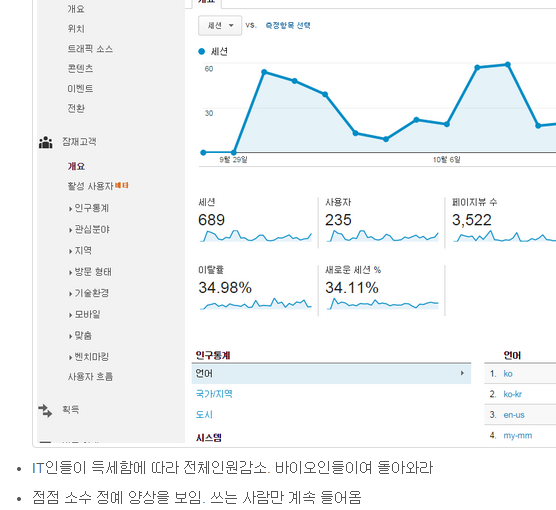
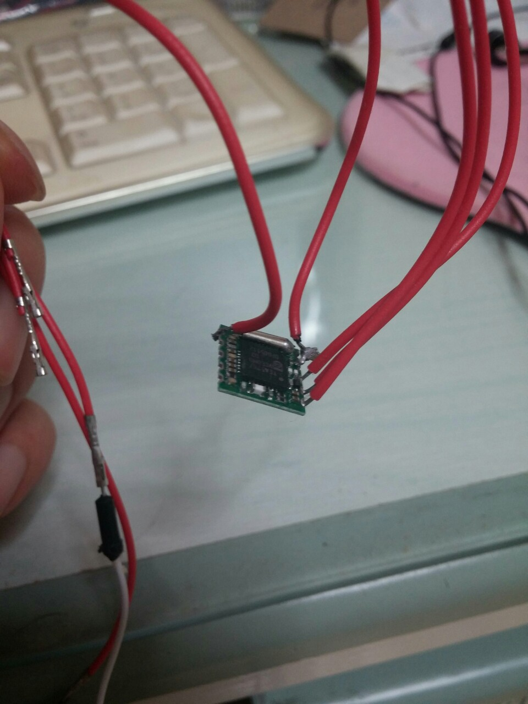

name: inverse
layout: true
---
class: title, center, middle, inverse

라즈베리파이 뿜뿌질
# <span class="sky">R</span>asberry <span class="sky">P</span>i
.footnote[
- [onairradio](https://biospin.github.io) 바이오스핀
]

---
class: middle, inverse, full-text

문서지기, 지표방어


---
class: middle, inverse, full-text

물건을 팔러오다. 재미

---

class: middle, inverse, full-text

오늘의 주인공
RASPBERRY PI B+


---

class: middle, inverse, full-text

이런것들을 합니다.

- 라즈베리파이로 만든 휴대폰, PiPhone!
http://youtu.be/8eaiNsFhtI8

- 라즈베리파이로 제어하는 로봇,R2D2와 PiBBOT!
http://youtu.be/znuUm5vbSpI
http://youtu.be/D0ydpIZFtuM

---

class: middle, inverse, full-text

- 로봇팔을 작동시키는 라즈베리파이와 엑스박스360 컨트롤러!
http://youtu.be/xvKGxHoBBII

- 라즈베리파이 카메라를 장착한 쿼드콥터(4개의 프로펠러를 사용하는 초미니 헬리콥터)!
http://youtu.be/-dReyGvzAQw

-  휴대용게임기로 변신한 라즈베리파이!
http://youtu.be/6JuB0zOHGeg
http://youtu.be/8CA8tWJW8rk

---
class: middle, inverse, full-text

마이드스톰 동영상
http://www.youtube.com/watch?v=85kI6oBSXHY

큐빅맞추기
http://www.youtube.com/watch?v=adOcQVTGpGI
http://www.youtube.com/watch?v=staapsj3eRQ

이동로봇
http://www.youtube.com/watch?v=h5xSa-NaZtg

이중에 내꺼는? 신입시절 월급으로 만든거?
---
class: middle, inverse, full-text
이런걸 만듭니다 코크모
http://cafe.naver.com/lolkor/3453320
---
class: middle, inverse, full-text

뽐뿌질이 슬금슬금?
---

class: middle, inverse, full-text

왜 그 동안 못했을까?
---

class: middle, inverse, full-text

왜 하필 요즘?

---
class: middle, inverse, full-text

유비쿼터스랑 다른가?

---
class: middle, inverse, full-text

오픈! 하드웨어!

---

class: middle, inverse, full-text



---
class: middle, inverse, full-text

만들자 만들자의 진입장벽


---

class: middle, inverse, full-text

진입 장벽은 설정, 설치, 조립  입니다.

---

class: middle, inverse, full-text

이제 만들어 봅시다

---

class: middle, inverse, full-text

마잍드스통 vs 아두이노 vs 라즈베리파이

---

class: middle, inverse, full-text

표준 입/출력 모니터 마우스, 키보드

모터/센서온.습도/라디오모듈/스피커/디스플레이lcd/초음파/등등.

---

class: middle, inverse, full-text

hello world ~

led 전구에 붎켜기

---

class: middle, inverse, full-text


+ [빵판(브레드 보드)](http://www.icbanq.com/shop/product_detail.asp?prod_code=P005535466)
+ led 전구
+ 저항
+ [케이블](http://www.devicemart.co.kr/1113721)

---
class: middle, inverse, full-text

재료 살 수 있는곳
[[New버전] 라즈베리파이 Model B+ 단품](http://www.icbanq.com/shop/product_detail.asp?prod_code=P005587400&catg_code=115185)
[[New버전] 라즈베리파이 Model B+ Basic KIT](http://www.icbanq.com/shop/product_detail.asp?prod_code=P005607887&catg_code=115185)
icbanq  http://www.icbanq.com/shop/
디바이스마트 http://www.devicemart.co.kr/
공구카페  http://cafe.naver.com/mpucafe/4821

---
class: middle, inverse, full-text

라즈베리 os 다운로드
os 다운로드. 종류 다양 raspbian 를 받자
http://www.raspberrypi.org/downloads/
raspbian zip download

---

class: middle, inverse, full-text

win32diskimager
윈도우 프로그램이용
img 파일을 sd 카드에 씌움
라즈베리파이 부팅 붕~

---

class: middle, inverse, full-text

라즈베리 b+ GPIO


---

class: middle, inverse, full-text


배선그리기
http://fritzing.org/download/
---

class: middle, inverse, full-text

```
sudo apt-get update
sudo apt-get install python-rpi.gpio

sudo python
>>>import RPi.GPIO as GPIO
>>>GPIO.setmode(GPIO.BCM)
>>>GPIO.setup(17, GPIO.OUT)
>>>GPIO.setup(17, GPIO.HIGH)
>>>GPIO.setup(17, GPIO.LOW)

```

---
class: middle, inverse, full-text

방금그라디오
쑥갓키우기

---

class: middle, inverse, full-text

<iframe width="560" height="315" src="//www.youtube.com/embed/kERdJyF-7RM" frameborder="0" allowfullscreen></iframe>

http://www.youtube.com/watch?v=kERdJyF-7RM
---
class: center, middle, inverse, full-text

".gold[라디오 노래]만 듣고 싶다.<br>
.gold[광고]는 안듣고 싶은데..<br>
노래만 골라들으면 안되나요<br>
노래만 듣고 싶다. "

.pull-right[-- 노래만 듣고 싶은이]

---

class: center, middle, inverse, full-text

```
import 라디오모듈

r.upVolume(1)
r.upDownVolume(1)

import 라디오모듈
import lcd디스플레이

data = request.url(방금그록라디오)
최신노래정보 = data.parse.get최근꺼

최신노래.제목
최신노래.라디오채널
최신노래.가수

d.display(제목)
d.display(채널)
d.display(가수)

r.channelt(라디오채널)
```

---
class: center, middle, inverse, full-text

".gold[선곡이짱] 방송국 작가분들 선곡에 감사합니다.<br>
.gold[광고는 NO!] 전하는 말씀은 듣고 싶지 않아요<br>
실시간 노래가 술술.. 방금 그 라디오!!

---

class: middle, inverse, full-text
# 준비물

1. [방금그곡api](http://music.daum.net/onair/timeline)
1. python3
1. raspberry pi
1. [TEA5767 FM 디지털 스테레오 라디오 모듈](http://itempage3.auction.co.kr/DetailView.aspx?ItemNo=A955319132&frm3=V2)
1. [Nokia 5110 LCD](http://www.devicemart.co.kr/31029)
1. [스피커](http://www.10x10.co.kr/shopping/category_prd.asp?itemid=898765&rdsite=nvshop_sp&NaPm=ct%3Dhzw68blk%7Cci%3Dd6f9db6ebddfcf32f6bd366d6b80154138ec0cdd%7Ctr%3Dsl%7Csn%3D219718%7Chk%3D69a0516a1216cf93849a469bda19f1d5330d3df7)
1. [빵판](http://www.devicemart.co.kr/32298)
1. 스위치
1. [점퍼케이블](http://www.devicemart.co.kr/32284)

---
class: middle, middle, inverse, full-text

 선연결
- https://github.com/XavierBerger/pcd8544
- 
---
class:  middle, inverse, full-text
# 작업

- [pcd8544 Python library 설치](https://github.com/XavierBerger/pcd8544)
- pil 라이브러리 python2 에서만 실행;;
- [python3 사용하기 위해 Pillow lib 설치한다](http://pillow.readthedocs.org/en/latest/installation.html)
- python3 각종 에러가 발생하는데 lcd.py 적절히 수정해 준다.
- 한글폰트 설치 sudo apt-get install ttf-unfonts-core
- 각종 설치
    ```python
    sudo pip-3.2 install wiringpi
    sudo pip-3.2 install wiringpi2
    sudo pip-3.2 install spidev
    sudo pip-3.2 install Pillow
    ```
---
class:  middle, inverse, full-text

# code
- [onair.py source](https://github.com/onairradio/onairradio.github.io/blob/master/onair.py)

    ```python
    ...
    ch = {825: (97.3, "KBS1 라디오"), 824: ( 93.1, "KBS FM1")
    , 827: (106.1, "KBS2 라디오"), 826: ( 89.1, "KBS FM2")
    , 828: (111, "KBS 3라디오")

    ...
    url = 'http://music.daum.net/onair/songlist.json?type=top&searchDate='
    resp = requests.post(url=url)
    data = json.loads(resp.text)
    ...
    resp = requests.post(url=url)
    data = json.loads(resp.text)

    for song in reversed(data['songList']):
        if song['channel']['channelType'] ...
    ```
---
class: middle, inverse, full-text

쑥갓키우기
https://play.google.com/store/search?q=%EC%91%A5%EA%B0%93%ED%82%A4%EC%9A%B0%EA%B8%B0&hl=ko

---

class: middle, middle, inverse, full-text
앞으로 만들꺼
메이크페어
해리포토 마법 지팡이
음성 + 동장인식..

---

class: middle, middle, inverse, full-text
라즈베리파이 공모전
http://happysntcontest.kofst.or.kr/index.php

공모전 응모자 중교육
http://happysntcontest.kofst.or.kr/file/2014%ED%96%89%EB%B3%B5%ED%95%9C%EA%B3%BC%ED%95%99%EA%B8%B0%EC%88%A0%EA%B3%B5%EB%AA%A8%EC%A0%84%20%EA%B0%9C%EB%B0%9C%EC%A7%80%EC%9B%90%20%EA%B5%90%EC%9C%A1%20%EC%95%88%EB%82%B4_141014.pdf

라즈베리파이교육
서울 1.8(토)~9(일), 09~18시 전자부품연구원 케티파트너스 지하1층 교육장

---

class: middle, middle, inverse, full-text

설문
https://dubu.typeform.com/to/LXbQui

---

class: middle, inverse, full-text


감사합니다

---