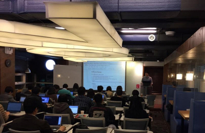

[gimmick:FacebookLike ( layout: 'standard', showfaces: false) ](http://biopy.github.io)

### 파이썬을 이용한 Bioinformatics 기초 part 3
- 2014년 11월 11일 - 2015년 2월 17일 (변경 가능)
- 매주 화요일 저녁. 7시 30분~9시 30분/10시
- 장소 : 토즈 강남점/타워점

### 최신글
- [part3-1 Chap 5 ,10장 컴퓨터비전, 확률 및 통계기초 - 2014.11.18](doc/part3/d02.md)
- [후기 - 2014.11.11](doc/afterSchool.md)
- [방문자 지표 - 2014.11.11](doc/analytics.md)

### 링크
- [facebook ](https://www.facebook.com/notes/%EB%B0%94%EC%9D%B4%EC%98%A4%EC%8A%A4%ED%95%80/%ED%8C%8C%EC%9D%B4%EC%8D%AC%EC%9D%84-%EC%9D%B4%EC%9A%A9%ED%95%9C-bioinformatics-%EA%B8%B0%EC%B4%88/566279330148620)
- http://biopython.net
- [github](https://github.com/biopy/biopy.github.io) [[권한신청]](doc/git_admin.md)
- [ipython notebooks](http://nbviewer.ipython.org/github/biopy/biopy.github.io/tree/master/notebook/)
- [biospin tube](http://www.youtube.com/channel/UClCglW1qWWYSaV7ESozld1w)
- [cloud server](http://cloud.biopython.net/)  ssh cloud.biopython.net 60915
- [google analytics](doc/analytics.md)
- [내부검색[새창]](https://www.google.com/cse/publicurl?cx=003731926665079035508:yiudsxulqkc)

